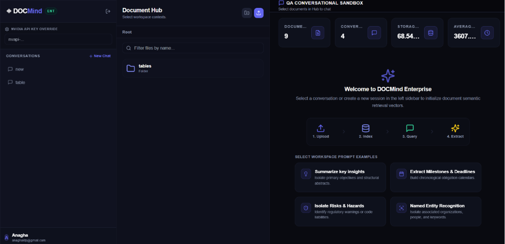
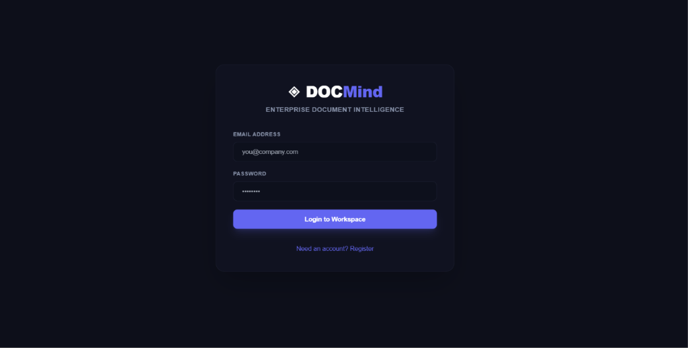
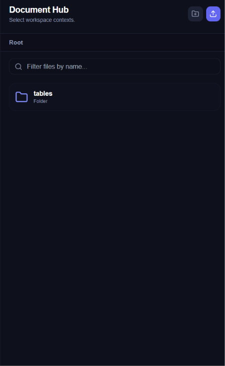
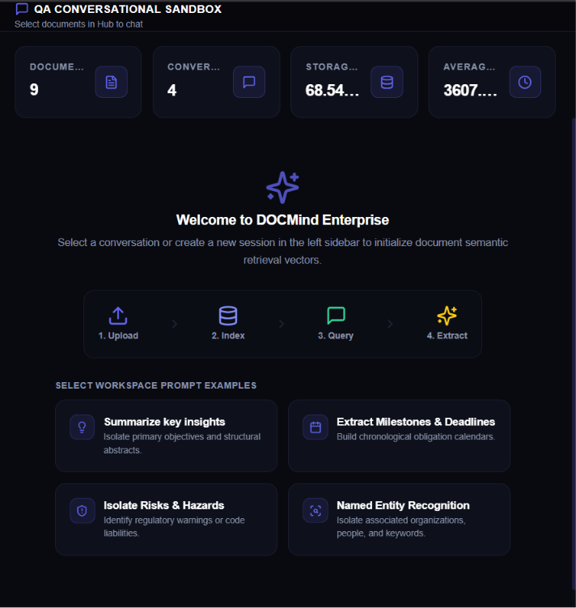
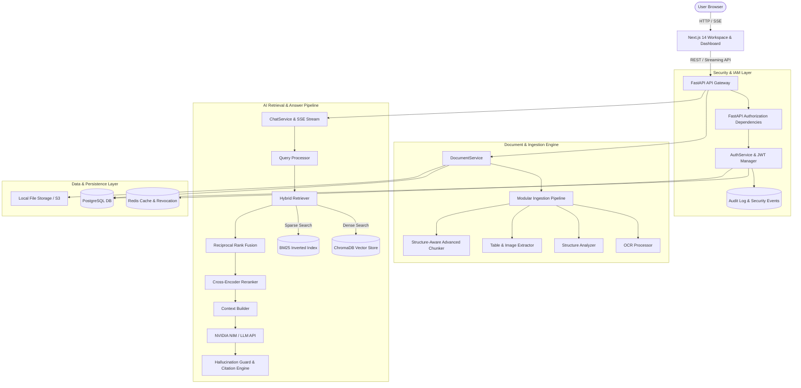
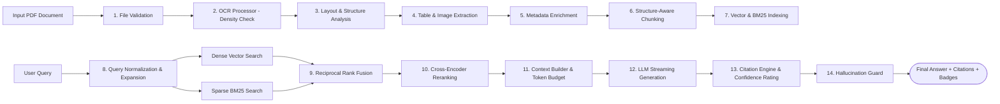

# DOCMind Enterprise

> **Production-Oriented AI Document Intelligence Platform**
> 
> *A modular, multimodal Retrieval-Augmented Generation (RAG) platform designed for document processing, hybrid semantic & keyword retrieval, continuous AI quality evaluation, and automated document structure analysis.*

DOCMind Enterprise is a full-stack, microservices-driven AI Document Intelligence Platform built with Next.js 14 (App Router), FastAPI, PostgreSQL, Redis, ChromaDB, and NVIDIA NIM endpoints. It transforms complex documents—including scanned PDFs, tabular financial reports, legal contracts, and technical manuals—into searchable, interactive AI workspaces. Featuring an advanced 9-stage multimodal ingestion pipeline, hybrid reciprocal rank fusion (RRF) search, cross-encoder reranking, evidence-grounded hallucination protection, interactive PDF page previewing, and an automated LLM evaluation and benchmarking suite, DOCMind Enterprise provides a complete end-to-end framework for reliable document Q&A.

---



---

## ✨ Project Highlights

- ✅ **Hybrid RAG Pipeline**: Fuses ChromaDB dense vector search, BM25 sparse keyword matching, Reciprocal Rank Fusion (RRF), and Cross-Encoder reranking.
- ✅ **Multimodal PDF Processing**: Density-aware OCR fallback, layout hierarchy detection, Markdown table grid parsing, and figure extraction.
- ✅ **Enterprise Authentication & RBAC**: Argon2id password hashing, JWT token pair rotation, device session tracking, and role-based access control (`USER` vs `ADMIN`).
- ✅ **Interactive Citation & PDF Preview**: Direct jump-to-page citation navigation, text snippet highlighting, and outline tree exploration.
- ✅ **AI Evaluation Dashboard**: Automated golden dataset evaluation suite measuring `Recall@K`, `NDCG`, `BLEU`, `ROUGE`, citation precision, hallucination risk, model cost/latency benchmarks, and regression alerts.
- ✅ **Dockerized Multi-Service Architecture**: Single-command container cluster setup using Docker Compose.
- ✅ **100% Verified Quality**: 88/88 backend pytest tests passing, zero TypeScript errors, zero Next.js build warnings.

---

## 🛡️ Badges


---

## ⚡ Quick Start

Launch the full platform (Frontend, Backend API, PostgreSQL, Redis, ChromaDB) in two minutes:

```bash
# 1. Clone the repository
git clone https://github.com/ANAGHAKTP/pdf_qa_chatbot.git
cd pdf_qa_chatbot

# 2. Configure environment defaults
cp backend/.env.example backend/.env

# 3. Launch Docker Compose cluster
docker compose up --build
```

Access local application endpoints:
- **Frontend Workspace**: [http://localhost:3000](http://localhost:3000)
- **AI Evaluation Dashboard**: [http://localhost:3000/evaluation](http://localhost:3000/evaluation)
- **Swagger API Documentation**: [http://localhost:8000/docs](http://localhost:8000/docs)

---

## ✨ Features

### Authentication & Security
- Dual-token JWT authentication (short-lived Access + rotated Refresh tokens with JTI tracking)
- Argon2id password security with unique salt generation
- Active session management, IP telemetry, and bulk `DELETE /sessions/others` session revocation
- Role-Based Access Control (`require_authenticated_user`, `require_role`)
- Event-driven security audit logging

### Document Workspace
- Drag-and-drop PDF upload with real-time background processing steppers
- Directory folder navigation, document renaming, and deletion
- Full-text conversation history search, pinning, and deletion

### AI & RAG Pipeline
- Hybrid Retrieval (Dense ChromaDB search + Sparse BM25 keyword search)
- Reciprocal Rank Fusion (RRF) rank aggregation
- Cross-Encoder candidate chunk reranking
- Parent Document Retrieval (400-char search granularity + full parent page context)
- Evidence-grounded citation engine with unique chunk ID tags (`[1]`, `[2]`)
- Confidence estimation (`HIGH`, `MEDIUM`, `LOW`) and Hallucination Guard claim auditing

### Multimodal Ingestion Pipeline
- Density-aware OCR fallback (Tesseract / pluggable `OCREngineInterface`)
- Document structure analysis (title, `H1`-`H3` heading hierarchy, lists)
- Table extraction into clean Markdown grids
- Image/figure caption and bounding box extraction
- Metadata enrichment (language detection, domain classification, keyword tagging)
- Structure-aware chunking preventing split tables, code blocks, or captions

### AI Evaluation & Benchmarking
- Golden Dataset runner supporting domain datasets (`finance`, `legal`, `manuals`) in JSON/YAML
- Retrieval quality metrics (`Recall@K`, `Precision@K`, `MRR`, `NDCG`)
- Text generation metrics (`BLEU`, `ROUGE-L`, `Answer Similarity`)
- Citation accuracy auditing and hallucination risk classification
- LLM & Embedding benchmarking (latency, token costs, search QPS)
- Prompt Registry versioning (`V1`, `V2`, `V3`) and automated regression detection
- Evaluation Dashboard (`/evaluation`) with multi-format exports (JSON, CSV, Markdown, HTML)

---

## 📸 Screenshots

### Login


*Secure authentication interface with Argon2id password security, session initialization, and dark SaaS branding.*

---

### Main Workspace


*Full-stack application layout featuring live conversation sidebar, document hub, KPI telemetry, and workspace prompt shortcuts.*

---

### Document Hub


*Hierarchical document library supporting nested folder navigation, instant filename filtering, PDF upload progress, and document cards.*

---

### AI Chat


*Conversational sandbox with KPI telemetry counters, RAG processing stepper, workspace prompt shortcuts, and streaming answer outputs.*

---

### Citation Preview


*Citation modal showing source page numbers, match confidence percentages, unique chunk IDs, and extracted text passages.*

---

### PDF Preview


*Interactive PDF viewer highlighting cited passages, showing document outline tree navigation, page zoom controls, and extracted asset counts.*

---

### Evaluation Dashboard


*Continuous quality dashboard displaying retrieval recall metrics, latency breakdown charts, model cost/performance comparison tables, and report exporters.*

---

### Swagger Documentation


*Interactive FastAPI Swagger UI (`/docs`) providing OpenAPI schema definitions and endpoint testing for all REST services.*

---

## 🏗️ Architecture Diagram



---

## 🧬 AI Pipeline Diagram



---

## 🛠️ Technology Stack

| Category | Technology | Purpose |
|---|---|---|
| **Frontend** | Next.js 14 (App Router), React 18, TypeScript, TailwindCSS | Responsive SaaS web application, glassmorphism workspace, SSE streaming chat, PDF previewer, evaluation dashboard |
| **Backend** | Python 3.11, FastAPI, Pydantic V2, Uvicorn | Asynchronous API gateway, dependency injection, REST endpoints, SSE streaming |
| **Relational DB** | PostgreSQL 15, SQLAlchemy ORM, Alembic | Data persistence (Users, Documents, Folders, Sessions, Audit Logs, Feedback) |
| **Cache & Revocation** | Redis 7.2 | Token revocation list, session cache, rate limiting |
| **Vector Store** | ChromaDB | Persistent vector database for semantic dense retrieval |
| **Sparse Retrieval** | Rank-BM25 (BM25Okapi) | Inverted index for keyword-exact document retrieval |
| **AI / LLM Endpoints** | NVIDIA NIM API / OpenAI / LangChain | Large language model inference, embeddings, and cross-encoder reranking |
| **OCR & Processing** | PyPDF, Pytesseract / Pillow, pdf2image | Digital and scanned PDF text extraction, reading order preservation, and OCR fallbacks |
| **Testing** | Pytest, Pytest-Asyncio, HTTPX | Backend unit, integration, IAM, RAG, and multimodal test suites |
| **Orchestration** | Docker, Docker Compose | Multi-container cluster orchestration for backend, frontend, PostgreSQL, Redis, and ChromaDB |

---

## 🔑 Environment Variables

| Variable | Default Value | Description |
|---|---|---|
| `PROJECT_NAME` | `DOCMind Enterprise` | Application title |
| `API_V1_STR` | `/api/v1` | API endpoint base prefix |
| `SECRET_KEY` | `secret` | Secret key used for signing JWT Access Tokens |
| `ACCESS_TOKEN_EXPIRE_MINUTES` | `15` | Expiration time for Access Tokens in minutes |
| `REFRESH_TOKEN_EXPIRE_DAYS` | `7` | Expiration time for Refresh Tokens in days |
| `POSTGRES_SERVER` | `localhost` | PostgreSQL database host address |
| `POSTGRES_USER` | `postgres` | PostgreSQL database username |
| `POSTGRES_PASSWORD` | `postgres` | PostgreSQL database password |
| `POSTGRES_DB` | `docmind_db` | PostgreSQL database name |
| `REDIS_HOST` | `localhost` | Redis server host address |
| `REDIS_PORT` | `6379` | Redis server port |
| `NVIDIA_API_KEY` | `""` | API key for NVIDIA NIM LLM endpoints |
| `NEXT_PUBLIC_API_URL` | `http://localhost:8000/api/v1` | Frontend environment variable pointing to backend API |

---

## 🏃 Running the Application

### Option A — Using Docker Compose (Recommended)
Run the entire platform (Frontend, Backend, PostgreSQL, Redis, ChromaDB) with one command:
```bash
docker compose up --build
```
Access the application services:
- **Frontend Workspace**: [http://localhost:3000](http://localhost:3000)
- **Evaluation Dashboard**: [http://localhost:3000/evaluation](http://localhost:3000/evaluation)
- **FastAPI API Root**: [http://localhost:8000](http://localhost:8000)
- **Swagger API Docs**: [http://localhost:8000/docs](http://localhost:8000/docs)
- **Prometheus Metrics**: [http://localhost:8000/metrics](http://localhost:8000/metrics)

### Option B — Manual Local Setup

#### 1. Start Backend Services
```bash
cd backend
python -m venv .venv
# On Windows:
.venv\Scripts\activate
# On Linux/macOS:
source .venv/bin/activate

pip install -r requirements.txt
uvicorn app.main:app --reload --host 0.0.0.0 --port 8000
```

#### 2. Start Frontend Services
```bash
cd frontend
npm install
npm run dev
```
Navigate to [http://localhost:3000](http://localhost:3000).

---

## 📚 API Documentation

DOCMind Enterprise provides automated Swagger UI and ReDoc documentation.

- **Swagger UI**: [http://localhost:8000/docs](http://localhost:8000/docs)
- **ReDoc**: [http://localhost:8000/redoc](http://localhost:8000/redoc)

### Endpoint Overview

```text
POST   /api/v1/auth/register           # Register new user account
POST   /api/v1/auth/login              # Authenticate credentials & return JWT token pair
POST   /api/v1/auth/refresh            # Rotate Access Token using Refresh Token payload
POST   /api/v1/auth/logout             # Revoke active session tokens
GET    /api/v1/sessions                # List active user sessions
DELETE /api/v1/sessions/{session_id}   # Revoke specific user session
DELETE /api/v1/sessions/others         # Revoke all other active sessions except current
GET    /api/v1/documents/contents      # List folders and documents
POST   /api/v1/documents/upload        # Upload PDF & trigger multimodal ingestion pipeline
GET    /api/v1/documents/{id}/metadata # Retrieve enriched metadata (tables, figures, OCR stats)
GET    /api/v1/documents/{id}/preview  # Stream PDF file pages for PDF Preview panel
POST   /api/v1/chat/query              # Stream SSE response for conversational RAG queries
GET    /api/v1/evaluation/summary      # Fetch evaluation performance summary metrics
POST   /api/v1/evaluation/run          # Trigger batch evaluation run over golden datasets
GET    /api/v1/evaluation/export       # Export evaluation run reports (JSON, CSV, MD, HTML)
```

---

## 📂 Project Directory Structure

```text
pdf_qa_chatbot/
├── backend/
│   ├── app/
│   │   ├── ai/                      # AI Intelligence & Retrieval System
│   │   │   ├── ingestion/           # 9-Stage Multimodal Ingestion Subpackage
│   │   │   │   ├── file_validation.py  # Stage 1: File Validator
│   │   │   │   ├── ocr.py              # Stage 2: OCR Processor (Tesseract / Fallback)
│   │   │   │   ├── structure.py        # Stage 3: Document Structure Analyzer
│   │   │   │   ├── tables.py           # Stage 4: Table Extractor (Markdown Grids)
│   │   │   │   ├── images.py           # Stage 5: Image & Figure Extractor
│   │   │   │   ├── metadata.py         # Stage 6: Metadata Enricher
│   │   │   │   ├── chunker.py          # Stage 7: Advanced Structure-Aware Chunker
│   │   │   │   └── pipeline.py         # Stage 8 & 9: Ingestion Pipeline Orchestrator
│   │   │   ├── citation_engine.py   # Citation formatting & chunk ID mapping
│   │   │   ├── confidence.py        # Confidence estimator (HIGH / MEDIUM / LOW)
│   │   │   ├── context_builder.py   # Parent context builder & token budget manager
│   │   │   ├── hallucination_guard.py# Context sufficiency & claim validation
│   │   │   ├── query_processor.py   # Query rewriting & expansion
│   │   │   ├── retriever.py         # Dense, BM25, RRF, & Cross-Encoder reranker
│   │   │   └── pipeline.py          # Master RAG Answer Pipeline
│   │   ├── evaluation/              # AI Evaluation & Benchmarking Framework
│   │   │   ├── datasets/            # Golden Datasets (finance, legal, manuals, etc.)
│   │   │   ├── answer_metrics.py    # BLEU, ROUGE-L, & Similarity metrics
│   │   │   ├── citation_metrics.py  # Citation accuracy & precision metrics
│   │   │   ├── dataset_loader.py    # JSON & YAML golden dataset loader
│   │   │   ├── embedding_benchmark.py # Embedding model benchmarks
│   │   │   ├── exporters.py         # JSON, CSV, Markdown, & HTML report exporters
│   │   │   ├── hallucination_analyzer.py # Hallucination risk classifier
│   │   │   ├── model_benchmark.py   # LLM model benchmarks (latency, cost, tokens)
│   │   │   ├── prompt_registry.py   # Prompt versioning (V1, V2, V3)
│   │   │   ├── regression.py        # Regression detector vs. baseline
│   │   │   ├── retrieval_metrics.py # Recall@K, Precision@K, MRR, & NDCG
│   │   │   └── runner.py            # Automated Evaluation Runner
│   │   ├── api/                     # FastAPI Route Endpoints (Auth, Doc, Chat, Eval, Session)
│   │   ├── core/                    # Config settings, Security, & Metrics
│   │   ├── db/                      # SQLAlchemy Models & Sessions
│   │   ├── repositories/            # Data Repositories
│   │   └── services/                # Core Business Logic Services
│   ├── tests/                       # Complete Pytest Test Suite (88/88 Passing)
│   ├── Dockerfile
│   └── requirements.txt
├── docs/
│   └── screenshots/                 # Application Screenshots Gallery
├── frontend/
│   ├── src/
│   │   ├── app/                     # Next.js 14 Pages (/evaluation, /login, /register, etc.)
│   │   ├── components/              # Modular UI Components
│   │   │   ├── chat/                # ChatWindow, ChatMessage, CitationCard, etc.
│   │   │   ├── documents/           # DocumentList, DocumentCard, PdfPreviewPanel, etc.
│   │   │   ├── sidebar/             # ConversationSidebar, ConversationItem
│   │   │   └── workspace/           # WorkspaceLayout
│   │   ├── hooks/                   # Custom Hooks (useChat, useDocuments, useStreaming)
│   │   ├── lib/                     # API Client & Auth Context
│   │   └── types/                   # TypeScript Type Interfaces
│   ├── Dockerfile
│   └── package.json
├── sample_documents/                # Tracked sample PDFs for instant testing
├── docker-compose.yml               # Cluster Orchestration Configuration
└── README.md
```

---

## 🧪 Testing & Quality Assurance

```text
Backend Execution:
  ✅ 88/88 pytest tests passing (100% success rate)

Frontend Verification:
  ✅ Next.js production build successful
  ✅ 12 static pages prerendered
  ✅ Zero TypeScript errors
  ✅ Zero hydration warnings
```

---

## ⚡ Performance & Efficiency

- **Low-Latency Hybrid Retrieval**: Designed to support low-latency hybrid retrieval through dense vector search + sparse keyword search and cross-encoder reranking.
- **Real-Time SSE Streaming**: Supports real-time token streaming over Server-Sent Events (SSE) for low time-to-first-token user experiences.
- **Structure-Aware Chunking**: Eliminates context fragmentation by preserving full table grids and figure captions inside single unbroken chunks.
- **Disk-Based Index Caching**: BM25 inverted indices and parent document text maps are cached on disk (`./data/bm25`, `./data/parents`) for fast lookup during retrieval operations.

---

## 🔒 Security & IAM

- **Password Hashing**: Implements Argon2id with unique salt values.
- **Dual JWT Token Architecture**: Short-lived Access Tokens paired with rotated Refresh Tokens carrying unique JTI identifiers.
- **Session Revocation**: Redis-backed token revocation list allows users to revoke suspicious active sessions immediately.
- **Role-Based Access Control (RBAC)**: Enforces access restrictions on administrative routes using FastAPI authorization dependencies.
- **Audit Logging**: Logs security-critical IAM events (logins, session revocations, password resets) without recording sensitive user credentials or document contents.

---

## 📈 AI Evaluation Framework

The platform features a dedicated AI Evaluation Framework located in `backend/app/evaluation/`:

1. **Golden Datasets**: Standardized query test cases containing expected answers, page citations, and confidence scores across domain categories (`finance`, `legal`, `manuals`).
2. **Retrieval Benchmark**: Measures retrieval precision (`Recall@K`, `Precision@K`, `MRR`, `NDCG`).
3. **Citation Quality**: Audits generated citations against ground-truth source pages to detect wrong, missing, or hallucinated citations.
4. **Hallucination Detection**: `HallucinationAnalyzer` scores unsupported claims and evidence gaps.
5. **Regression Detector**: Automatically flags quality drops (>5%) or latency spikes against baseline benchmarks.

---

## 🗺️ Project Roadmap

- [x] **Phase 1**: Core Document Q&A RAG Engine
- [x] **Phase 2**: Enterprise IAM, JWT & Security Architecture
- [x] **Phase 3**: Session Management & Role-Based Access Control (RBAC)
- [x] **Phase 4**: Production REST API Layer & Swagger Documentation
- [x] **Phase 5**: Next.js Glassmorphism Workspace & Interactive UI Components
- [x] **Phase 6A**: AI Intelligence Layer (Query Processor, Hybrid RRF, Cross-Encoder Reranker)
- [x] **Phase 6B**: Multimodal Document Intelligence (OCR, Tables, Images, Structure, PDF Preview)
- [x] **Phase 6C**: AI Evaluation & Benchmarking Framework (Golden Datasets, Metrics, Dashboard)
- [ ] **Phase 7A**: Production Deployment & DevOps
- [ ] **Phase 7B**: Enterprise Integrations
- [ ] **Phase 7C**: Production Hardening

---

## 🤝 Contributing

Contributions are welcome! Please follow these steps to contribute:

1. **Fork the Repository**: Click the 'Fork' button at the top right of this repository.
2. **Create a Feature Branch**: `git checkout -b feature/amazing-feature`
3. **Commit Your Changes**: `git commit -m 'Add amazing feature'`
4. **Push to the Branch**: `git push origin feature/amazing-feature`
5. **Open a Pull Request**: Submit a Pull Request describing your proposed changes.

Please ensure all backend pytest tests pass (`pytest tests`) and the Next.js frontend builds without errors (`npm run build`) before opening a Pull Request.

---

## 👤 Author

**Anagha K T P**  
*Artificial Intelligence & Machine Learning Engineer*

- **GitHub**: [@ANAGHAKTP](https://github.com/ANAGHAKTP)
- **LinkedIn**: [https://linkedin.com/in/anaghaktp](https://linkedin.com/in/anaghaktp)
- **Portfolio / Repository**: [https://github.com/ANAGHAKTP/pdf_qa_chatbot](https://github.com/ANAGHAKTP/pdf_qa_chatbot)
