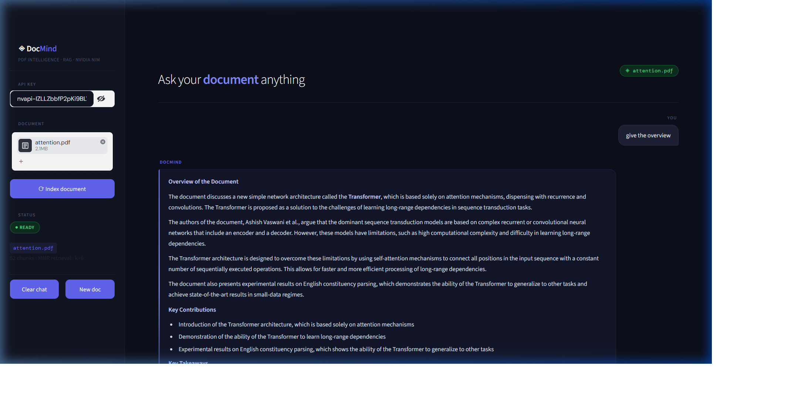
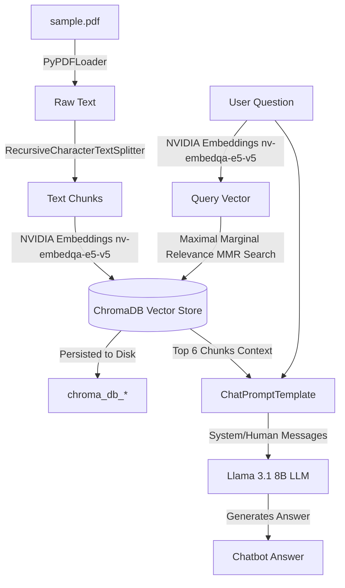

# PDF Question Answering Chatbot 🤖📄

> Ask anything from any PDF using modern Retrieval-Augmented Generation (RAG) powered by NVIDIA NIM endpoints and LangChain.

This project is a CLI-based chatbot that allows you to load any PDF document, parse its content, build a local vector database, and ask natural language questions about it. It uses state-of-the-art LLMs (`meta/llama-3.1-8b-instruct`) and high-performance vector embeddings (`nvidia/nv-embedqa-e5-v5`) served via NVIDIA NIM to locate and answer from the context of your document.

---

## 🌟 Key Features

- **NVIDIA NIM Integration**: Uses high-throughput, low-latency API models served directly by NVIDIA.
- **Interactive Streamlit Web UI**: Built a beautiful, responsive web-based UI featuring dark mode styling, session state memory, custom status badges, and interactive chat elements.
- **Modern LangChain Expression Language (LCEL)**: Built using the latest LangChain practices (`create_retrieval_chain` and `create_stuff_documents_chain`) to eliminate deprecation warnings.
- **Smart PDF Selection**: Automatically scans the root directory for `.pdf` files in the CLI interface. If multiple files are found, it provides an interactive selection menu.
- **Local Database Persistence**: ChromaDB is persisted locally (`./chroma_db_<pdf_name>`), meaning your PDF is only embedded *once*. Subsequent runs load instantly from disk! *(If you update your PDF and need to re-index it, simply delete the corresponding database folder to force a rebuild).*
- **Zero-Configuration Prompting**: If your `NVIDIA_API_KEY` is not set, the app will securely prompt you for it on the first run and offer to save it in `.env` (which is safely git-ignored).
- **Custom System Prompts**: Instructs the model to limit answers to the document context and avoid hallucinations.

---

## 🛠️ Project Structure

```text
pdf_qa_chatbot/
├── app.py               # Main CLI chatbot application
├── streamlit_app.py     # Streamlit web application with custom UI
├── requirements.txt     # Python dependency definition
├── .env.example         # Template environment variables
├── .gitignore           # File to ignore secrets, database folders, and PDFs
└── README.md            # Project documentation and portfolio write-up
```

---

## ⚙️ Installation & Setup

### Prerequisites
- Python 3.9 or higher
- An NVIDIA NIM API Key ([Get a free key with 1000 credits here](https://build.nvidia.com))

### 1. Clone the Repository
```bash
git clone https://github.com/your-username/pdf_qa_chatbot.git
cd pdf_qa_chatbot
```

### 2. Install Dependencies
Install the required packages using `requirements.txt`:
```bash
pip install -r requirements.txt
```

### 3. Set Up Environment Variables
Copy the template `.env.example` file to `.env`:
```bash
# On Linux/macOS
cp .env.example .env

# On Windows (PowerShell/CMD)
copy .env.example .env
```
Open `.env` and add your NVIDIA API Key:
```text
NVIDIA_API_KEY=nvapi-your-actual-nvidia-key-here
```
*(Alternatively, you can just run the application and it will prompt you to enter and save the API key automatically!)*

---

## 🚀 How to Run

### Option 1: Run via Streamlit Web UI
To launch the chatbot in your web browser with a premium dark-themed interface:
```bash
streamlit run streamlit_app.py
```
Open the URL shown in the terminal (usually `http://localhost:8501`). In the sidebar, paste your NVIDIA API key (if not already set in `.env`), drag & drop a PDF, and click **Process PDF** to start asking questions!



### Option 2: Run via CLI Chatbot
1. **Place your PDF file** (e.g. `sample.pdf`, a research paper, manual, or your resume) directly into the root folder of this project.
2. Run the application:
   ```bash
   python app.py
   ```
3. If multiple PDFs exist, select your file from the menu.
4. Ask questions directly in the terminal! Type `exit` or `quit` to end the session.

> [!TIP]
> If you update your PDF file or want to force a clean re-indexing, delete the persisted database folder before running:
> - **Windows**: `rmdir /s /q chroma_db_sample_pdf` (replace `sample_pdf` with your PDF's name)
> - **macOS/Linux**: `rm -rf chroma_db_sample_pdf`

---

## 🧠 RAG Architecture



1. **Document Loading**: Text is extracted from the PDF pages using `PyPDFLoader`.
2. **Text Chunking**: Splitting text into chunks of `1000` characters with a `200` character overlap to maintain semantic context boundaries.
3. **Embeddings & Persistence**: Text chunks are converted into dense vectors using `nvidia/nv-embedqa-e5-v5` embeddings and stored locally in `chroma_db_<pdf_name>`.
4. **Retrieval & RAG Chain**: When you ask a question, the vector store retrieves the top 6 most relevant chunks using Maximal Marginal Relevance (MMR) search (optimizing for relevance and diversity). These chunks are embedded into a system prompt context and sent to `meta/llama-3.1-8b-instruct` to formulate a concise, factual response.

---

## 🚀 Future Enhancements (Roadmap)

- [ ] **Chat History & Session Memory**: Support multi-turn conversations by allowing the agent to remember context from prior messages.
- [ ] **Cross-Document Comparison**: Enable analyzing and comparing key terms, statistics, or metrics across multiple uploaded PDFs.
- [ ] **Alternative Frontend (Gradio)**: Build a second Gradio interface to offer alternative web deployment layouts.
- [ ] **Multi-PDF Directory Support**: Expand the CLI loader using `DirectoryLoader` to scan and index a folder containing multiple PDFs at once.
- [ ] **Hybrid Search**: Combine vector search with keyword search (BM25) for more accurate retrieval.
- [ ] **Open-Source Local LLMs**: Add support for running fully offline using Ollama and local models like Llama 3 or Mistral.
